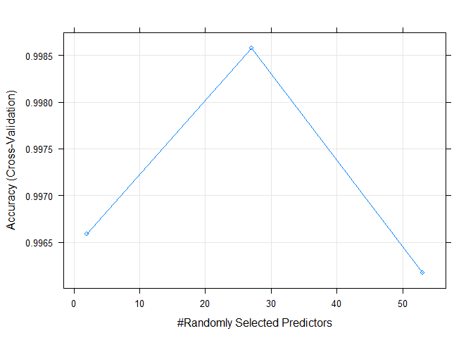
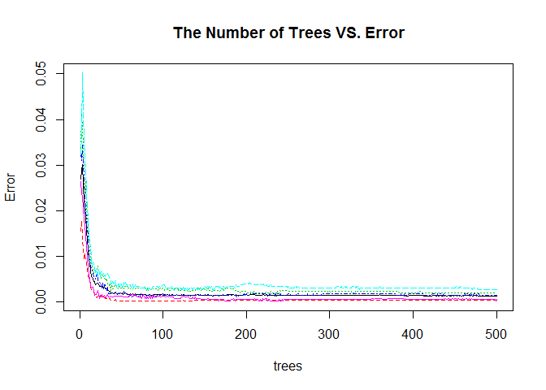
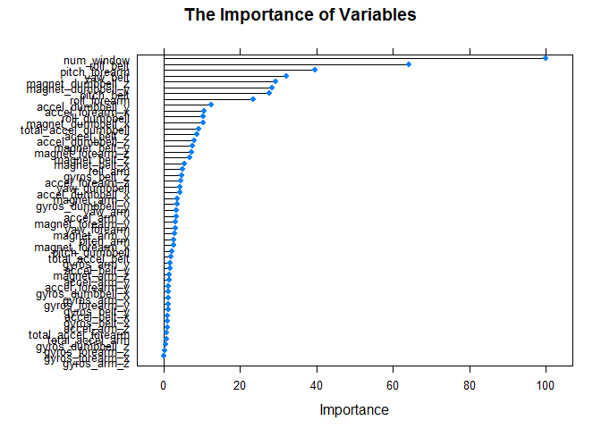

# Assignment

# Overview

The goal of your project is to predict the manner in which they did the exercise. This is the "classe" variable in the training set. You may use any of the other variables to predict with. You should create a report describing how you built your model, how you used cross validation, what you think the expected out of sample error is, and why you made the choices you did. You will also use your prediction model to predict 20 different test cases.

# Data Proprocessing

1. Load packages

```r
library(ggplot2)
library(caret)
```

```
## Loading required package: lattice
```

```r
library(e1071)
library(randomForest)
```

```
## randomForest 4.6-12
```

```
## Type rfNews() to see new features/changes/bug fixes.
```

```
## 
## Attaching package: 'randomForest'
```

```
## The following object is masked from 'package:ggplot2':
## 
##     margin
```

```r
library(gbm)
```

```
## Loading required package: survival
```

```
## 
## Attaching package: 'survival'
```

```
## The following object is masked from 'package:caret':
## 
##     cluster
```

```
## Loading required package: splines
```

```
## Loading required package: parallel
```

```
## Loaded gbm 2.1.1
```

```r
library(rpart)
library(survival)
library(splines)
library(plyr)
library(doParallel)
```

```
## Loading required package: foreach
```

```
## Loading required package: iterators
```

```r
library(rpart)
```


2. Load data

```r
training<- read.csv("pml-training.csv", head=TRUE, sep=",", na.strings=c("NA","#DIV/0!","")) 
testing <- read.csv("pml-testing.csv", head=TRUE, sep=",", na.strings=c("NA","#DIV/0!",""))
```

3. Get rid of columns with mostly Null values (the columns with 95% null values)

```r
GoodColumns <- !apply(training, 2, function(x) sum(is.na(x))/length(x) > 0.95)
training <- training[, GoodColumns]
```

4. Get rid of columns with near zero variance

```r
SelectColumns2 <- nearZeroVar(training, saveMetrics = TRUE)
training <- training[, SelectColumns2$nzv == FALSE]
```

5. Get rid of columns non-measurement data

```r
training <- training[, -c(1:5)]
```

6. Split the training data into training data and validation data

```r
set.seed(123456)
inTrain <- createDataPartition(y=training$classe,
                              p=0.6, list=FALSE)
trainingT <- training[inTrain,]
validating <- training[-inTrain,]
```


# Model Building
1. Using 10-folder cross validation within training data

```r
folders <- trainControl(method = "cv", number=10)
```

2. Model Selection
2.1 Baseline model:Decision Tree (with 10 folders cross-validation)
it's always easier to start with simple models. So let's start with decision tree model

```r
mod_dt <- train(classe ~ ., data=trainingT, trControl = folders, method="rpart")
mod_dt_val <- predict(mod_dt,validating)
confusionMatrix(mod_dt_val, validating$classe)
```

```
## Confusion Matrix and Statistics
## 
##           Reference
## Prediction    A    B    C    D    E
##          A 2036  620  634  583  231
##          B   36  397   18  222   75
##          C  154  501  716  481  478
##          D    0    0    0    0    0
##          E    6    0    0    0  658
## 
## Overall Statistics
##                                           
##                Accuracy : 0.4852          
##                  95% CI : (0.4741, 0.4963)
##     No Information Rate : 0.2845          
##     P-Value [Acc > NIR] : < 2.2e-16       
##                                           
##                   Kappa : 0.3275          
##  Mcnemar's Test P-Value : NA              
## 
## Statistics by Class:
## 
##                      Class: A Class: B Class: C Class: D Class: E
## Sensitivity            0.9122  0.26153  0.52339   0.0000  0.45631
## Specificity            0.6316  0.94453  0.75085   1.0000  0.99906
## Pos Pred Value         0.4961  0.53075  0.30730      NaN  0.99096
## Neg Pred Value         0.9476  0.84207  0.88180   0.8361  0.89084
## Prevalence             0.2845  0.19347  0.17436   0.1639  0.18379
## Detection Rate         0.2595  0.05060  0.09126   0.0000  0.08386
## Detection Prevalence   0.5231  0.09534  0.29697   0.0000  0.08463
## Balanced Accuracy      0.7719  0.60303  0.63712   0.5000  0.72769
```
Accuracy of decision tree model is 52%. So the model is completely useless.

2.2 Ramdon Forest Model

```r
mod_rf <- train(classe ~ ., data=trainingT, trControl = folders, method="rf")
mod_rf_val <- predict(mod_rf,validating)
confusionMatrix(mod_rf_val, validating$classe)
```

```
## Confusion Matrix and Statistics
## 
##           Reference
## Prediction    A    B    C    D    E
##          A 2232    2    0    0    0
##          B    0 1512    1    0    0
##          C    0    4 1367   12    0
##          D    0    0    0 1274    2
##          E    0    0    0    0 1440
## 
## Overall Statistics
##                                           
##                Accuracy : 0.9973          
##                  95% CI : (0.9959, 0.9983)
##     No Information Rate : 0.2845          
##     P-Value [Acc > NIR] : < 2.2e-16       
##                                           
##                   Kappa : 0.9966          
##  Mcnemar's Test P-Value : NA              
## 
## Statistics by Class:
## 
##                      Class: A Class: B Class: C Class: D Class: E
## Sensitivity            1.0000   0.9960   0.9993   0.9907   0.9986
## Specificity            0.9996   0.9998   0.9975   0.9997   1.0000
## Pos Pred Value         0.9991   0.9993   0.9884   0.9984   1.0000
## Neg Pred Value         1.0000   0.9991   0.9998   0.9982   0.9997
## Prevalence             0.2845   0.1935   0.1744   0.1639   0.1838
## Detection Rate         0.2845   0.1927   0.1742   0.1624   0.1835
## Detection Prevalence   0.2847   0.1928   0.1763   0.1626   0.1835
## Balanced Accuracy      0.9998   0.9979   0.9984   0.9952   0.9993
```
Accuracy of random forest model is 99.7% for validation dataset. So it's a very good model and we decide to use ramdon forest to build the final model.

3. Analysis of the best model
3.1 Build random forest model again using combined training data and validation data

```r
mod_final <- train(classe ~ ., data=training, trControl = folders, method="rf")
mod_final_eva <- predict(mod_final,training)
confusionMatrix(mod_final_eva, training$classe)
```

```
## Confusion Matrix and Statistics
## 
##           Reference
## Prediction    A    B    C    D    E
##          A 5580    0    0    0    0
##          B    0 3797    0    0    0
##          C    0    0 3422    0    0
##          D    0    0    0 3216    0
##          E    0    0    0    0 3607
## 
## Overall Statistics
##                                      
##                Accuracy : 1          
##                  95% CI : (0.9998, 1)
##     No Information Rate : 0.2844     
##     P-Value [Acc > NIR] : < 2.2e-16  
##                                      
##                   Kappa : 1          
##  Mcnemar's Test P-Value : NA         
## 
## Statistics by Class:
## 
##                      Class: A Class: B Class: C Class: D Class: E
## Sensitivity            1.0000   1.0000   1.0000   1.0000   1.0000
## Specificity            1.0000   1.0000   1.0000   1.0000   1.0000
## Pos Pred Value         1.0000   1.0000   1.0000   1.0000   1.0000
## Neg Pred Value         1.0000   1.0000   1.0000   1.0000   1.0000
## Prevalence             0.2844   0.1935   0.1744   0.1639   0.1838
## Detection Rate         0.2844   0.1935   0.1744   0.1639   0.1838
## Detection Prevalence   0.2844   0.1935   0.1744   0.1639   0.1838
## Balanced Accuracy      1.0000   1.0000   1.0000   1.0000   1.0000
```
It's common sense to build your final model using complete traning dataset to make a better model. 

3.2 Visulize the importance of variables

```r
plot(mod_final)
```

<!-- -->

```r
plot(mod_final$finalModel,main = "The Number of Trees VS. Error")
```

<!-- -->

```r
plot(varImp(mod_final),main = "The Importance of Variables")
```

<!-- -->


# Prediction for Test Data

```r
predict <- predict(mod_final, testing)
predict
```

```
##  [1] B A B A A E D B A A B C B A E E A B B B
## Levels: A B C D E
```
